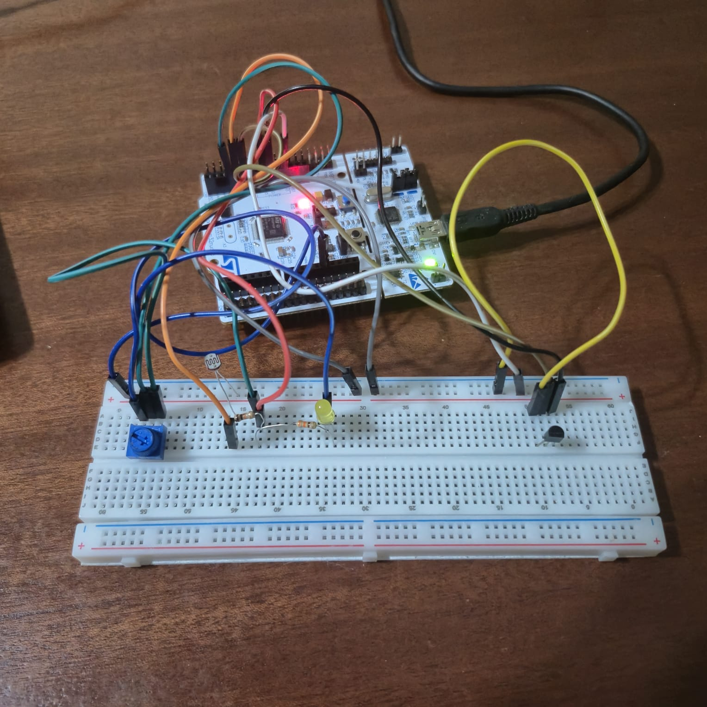
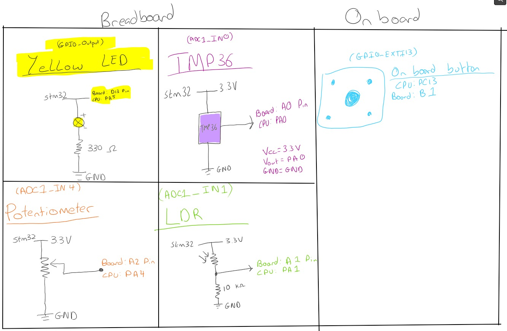
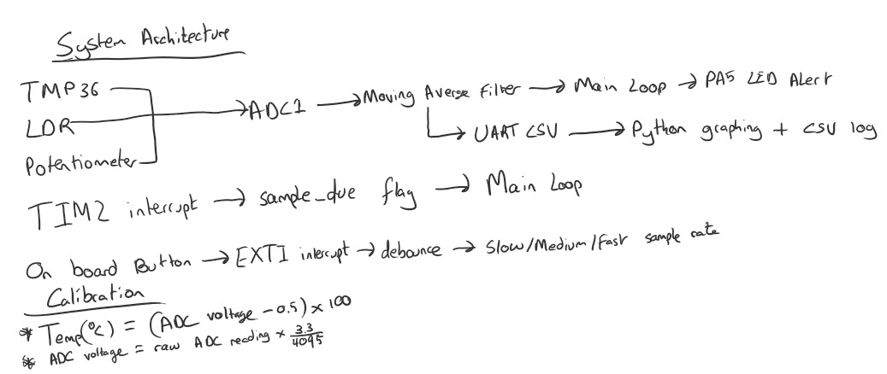
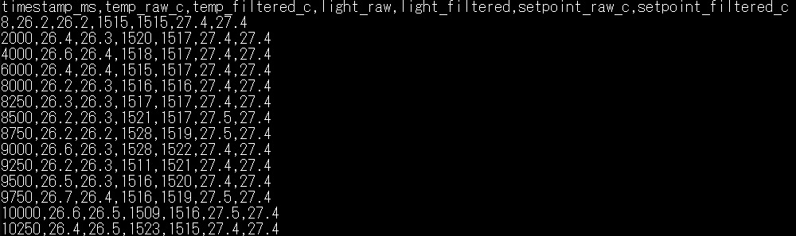
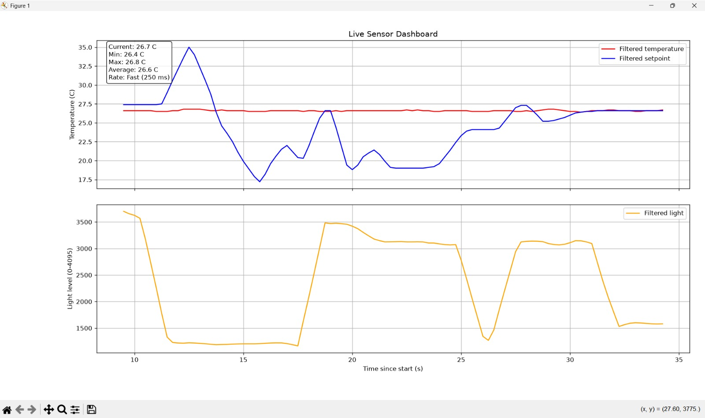

# STM32 Interrupt-Driven Multi-Sensor Data Logger

This project is a multisensor data logger built with an STM32 NUCLEO-F401RE. It reads temperature, light level and an adjustable temperature setpoint, smooths the readings, sends CSV data over UART, and displays the data on a live Python dashboard.

I used the potentiometer as an adjustable temperature setpoint from 15 °C to 35 °C, so the project can compare the measured temperature against a chosen setpoint and control an LED alert.

## Features

- Three ADC inputs: TMP36 temperature sensor, LDR light sensor and potentiometer.
- TMP36 reading converted from ADC value into degrees Celsius.
- 5 sample moving average filter used on all three ADC inputs.
- Adjustable temperature setpoint ranging between 15 °C and 35 °C.
- LED alert when filtered temperature is above filtered setpoint.
- UART CSV output at 115200 baud.
- On board button changes between slow, medium and fast sample rates.
- Button debounce to avoid accidental double presses.
- TIM2 interrupt schedules sampling without doing long ADC or UART work inside the interrupt.
- Python script safely reads the serial data, logs it to CSV and shows a live dashboard.

## Hardware

| Component | Purpose |
|---|---|
| TMP36 | Temperature sensor |
| LDR and 10 kΩ resistor | Light-level voltage divider |
| Potentiometer | Adjustable temperature setpoint |
| Yellow LED and 330 Ω resistor | Temperature alert |

## Hardware setup



## Pin map

| STM32 pin | Connection / use |
|---|---|
| PA0 / A0 / ADC1_IN0 | TMP36 output |
| PA1 / A1 / ADC1_IN1 | LDR voltage divider output |
| PA4 / A2 / ADC1_IN4 | Potentiometer wiper |
| PA5 / LD2 / GPIO_Output | LED alert output |
| PC13 / B1 / GPIO_EXTI13 | Onboard button interrupt |
| TIM2 | 250 ms timer interrupt base |

## Circuit diagram



The TMP36 output connects to PA0. The LDR and 10 kΩ pull down resistor form a voltage divider connected to PA1. The potentiometer wiper connects to PA4.

## How it works

ADC1 runs in scan mode and reads the channels in this order:

1. TMP36 temperature sensor  
2. LDR light sensor  
3. Potentiometer setpoint  

Each new reading is saved into a five-sample buffer. The firmware averages the values before using them for the LED alert and UART output.

The onboard button on PC13 uses an external interrupt and a 200 ms debounce check. Each button press changes the sample rate:

| Mode | Sample interval |
|---|---:|
| Slow | 2000 ms |
| Medium | 1000 ms |
| Fast | 250 ms |

TIM2 generates an interrupt every 250 ms. The timer interrupt only updates a counter and sets a `sample_due` flag when it is time to take a new sample. The main loop then handles ADC conversion, filtering, LED control and UART output.

## System architecture



## UART CSV output

When the STM32 starts or resets, USART2 sends one header row once to label the CSV columns. Every message after that is a data row:

```text
timestamp_ms,temp_raw_c,temp_filtered_c,light_raw,light_filtered,setpoint_raw_c,setpoint_filtered_c
8250,26.3,26.3,1517,1517,27.4,27.4
8500,26.2,26.3,1521,1519,27.5,27.4
```

The output includes both raw and filtered temperature, light and setpoint values.



## Python dashboard

The Python script reads the serial data from the STM32, skips malformed rows, logs valid rows to `sensor_log.csv`, and plots the most recent 100 samples.

It skips malformed rows by:
1.Ignoring empty lines.
2.Ignoring the one header row.
3.Splitting each row at commas and checking it has exactly seven values.
4.Trying to convert each value into a number and then if this fails, it just prints `Skipped bad row` and continues instead of crashing.

The top graph shows filtered temperature and setpoint. The bottom graph shows filtered light level. It also displays the current, minimum, maximum and average temperature, along with the current sample rate.



## Running the Python dashboard

Install the packages:
1.`install pyserial matplotlib`
2.Check `PORT = "COM6"` in `Python/serial_reader.py`
Close Tera Term before running the Python script, because only one program can use the COM port at a time.

## Calibration note

The TMP36 calculation used was:

```text
ADC voltage = raw ADC reading × 3.3 / 4095
Temperature (°C) = (ADC voltage − 0.5) × 100
```

Indoor readings were approximately 26–27 °C.

## What I learned

- Multichannel ADC scanning on an STM32.
- Converting raw ADC values into useful sensor readings.
- Using moving average filtering to reduce noise.
- Sending structured CSV data over UART.
- Using timer and button interrupts to control when sampling happens.
- Reading serial data and making a live dashboard in Python.
- Combining embedded firmware and PC-side data logging in one project.
